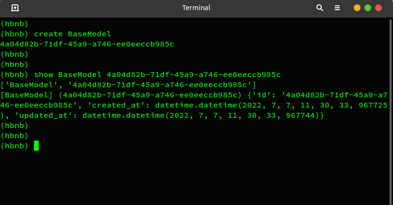

# AirBnB Clone - The console

___

## The Proyect
This is the first step towards building a full web application. And the first steps of this first step are:
* to put in place a parent class (called BaseModel) to take care of the initialization, serialization and deserialization of your future instances
* to create a simple flow of serialization/deserialization: Instance <-> Dictionary <-> JSON string <-> file
* to create all classes used for AirBnB (User, State, City, Place…) that inherit from BaseModel
* to create the first abstracted storage engine of the project: File storage.
* to create all unittests to validate all our classes and storage engine

## The Console of the Project
The project is going to be managed from the command line and we are going to be able to:
* Create a new object (ex: a new User or a new Place)
* Retrieve an object from a file, a database etc…
* Do operations on objects (count, compute stats, etc…)
* Update attributes of an object
* Destroy an object

___

## Commands
The console has been created for specific use-case: The AirBnB clone. The commands are shown in the next table:

| Command | Description | Usage |
| ---------- | ---- | --- |
| create | creates a new instance of `<class_name>`, saves to a JSON file and displays the id| `(hbnb) create` BaseModel |
| show	| prints the string representation of an instance based on the class name and id | `(hbnb) show <class_name> <class_id>` |
| Destroy	| deletes an instance based on the class name and id (save the change into the JSON file) |	`(hbnb) destroy <class_name> <class_id>` |
|all	| Prints all string representation of all instances based or not on the class name.	|`(hbnb) all <class_name>`
| update	|updates an instance based on the class name and id by adding or updating attribute (save the change into the JSON file).|	`(hbnb) update <class_name> <class_id> <attribute> <new_value>`
|quit and EOF	|exit the program|	`(hbnh) quit`|
|help	|displays the documented commands.|	`(hbnh) help`|
____

## Testing
The test files are located in the /tests directory, to run it you can use the command `python3 -m unittest discover tests`

____
## Author
Jaime Rodriguez G. [github](https://github.com/soft-insight), [twitter](https://twitter.com/jaimerodg)

